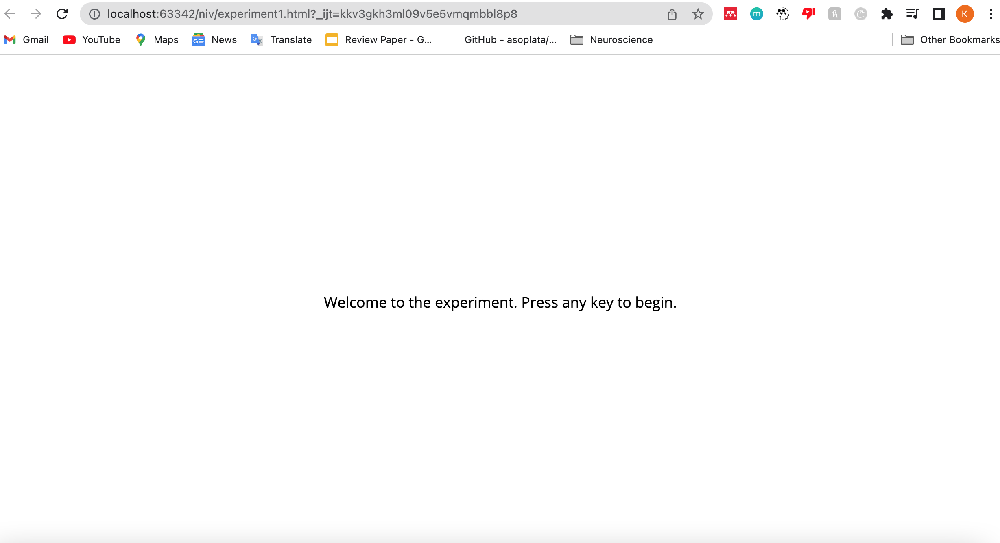

This is an experimental test for jspsych. The software I used was the JsPsych plug in and this was done on webstorm. There are files attached with images used in the code. Experiment3.html file is still a work in progress.

